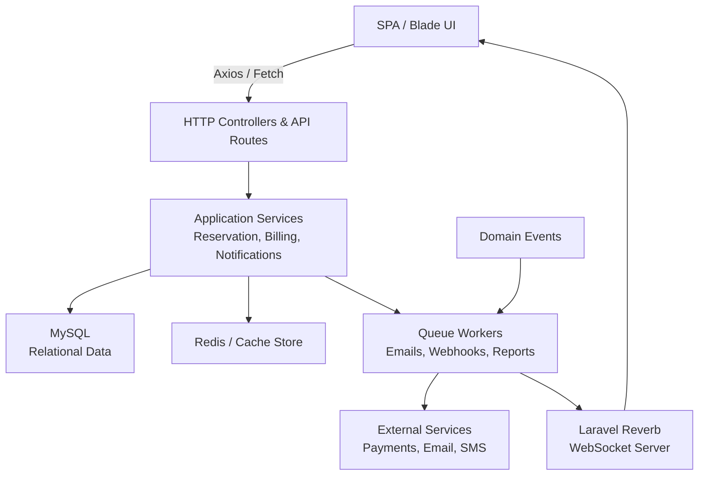
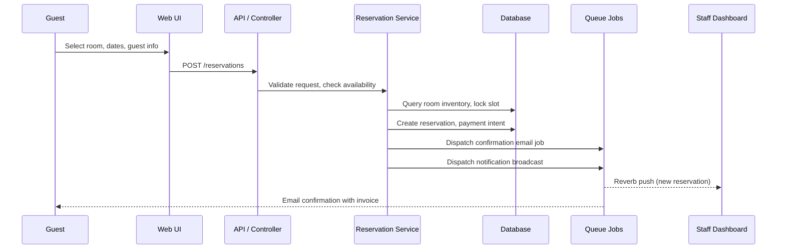

# Architecture Overview

Riad Projet follows a modular Laravel monolith architecture with clear separation between presentation, domain logic, and infrastructure concerns. The diagram below highlights the primary components.

## Modules
- **Presentation Layer**  
  Blade templates and Vue components served via Vite. Handles authentication, room browsing, reservation creation, and operational dashboards.

- **Reservation Domain**  
  Aggregates booking logic (availability checks, rate calculation, payment capture, cancellation policies). Exposes services consumed by controllers and jobs.

- **Billing & Payments**  
  Manages invoices, payment attempts, refunds, and integration with third-party payment gateways. Responsible for emitting events that trigger notifications.

- **Customer Management**  
  Stores guest profiles, loyalty details, and communication preferences. Links to reservations and invoices for complete history.

- **Inventory & Housekeeping**  
  Tracks room types, amenities, status (available, occupied, maintenance), and scheduling for cleaning tasks.

- **Notifications**  
  Dispatches transactional emails, in-app alerts, and WebSocket events via Laravel Reverb so staff dashboards stay up to date in real time.

## Reservation Flow

## Data Storage
- **MySQL** stores relational data such as rooms, bookings, invoices, and audit logs.
- **Redis (optional)** is used for caching availability lookups and broadcast queues.
- **Storage** directory holds uploaded assets (receipts, room photos) and generated reports. Credentials and sensitive settings live exclusively in `.env`.

## Operational Concerns
- **Migrations** manage schema versioning. Each feature branch includes its own migration files.
- **Queues** offload heavy work (emails, third-party APIs) to background workers.
- **Observability** uses Laravel logging plus optional integrations like Telescope or Debugbar in non-production environments.
- **Scaling** is achieved by running multiple PHP-FPM workers and Reverb instances behind a load balancer. MySQL replicas handle read-heavy workloads.
